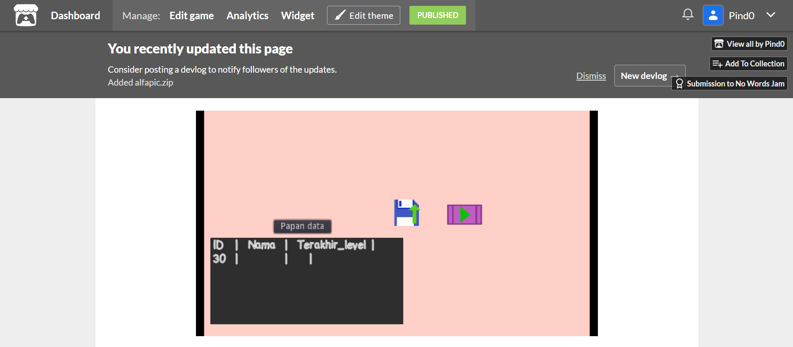

# Penjelasan Singkat
Game puzzle yang tidak ada kata. terdiri dari 10 level. Cara bermain melengkapi frame kosong dengan gambar2 yang di meja dimana gambar2 yang huruf pertama dari nama2 benda dalam bahasa inggris.
Game ini dibuat dengan bahasa pemrograman GDscript yang mengandung bahasa python dan javascript

## Klik ini

## Screenshot

# Foto Diagram
## use case Model

### 1. mulai

### 2. muat

### 3. simpan

### 4. statistik

## activity Model
### 1. mulai

### 2. muat level

### 3. simpan level

### 4. statistik

## sequence Model
### 1. mulai

### 2. muat level

### 3. simpan level

### 4. statistik

## class diagram

## deployment diagram

## data model

