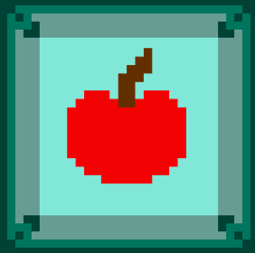
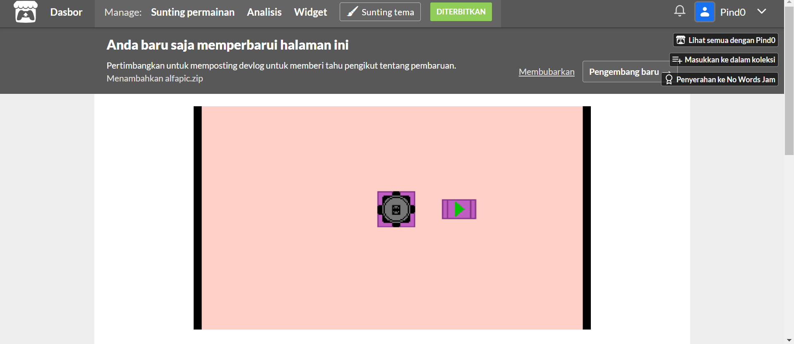
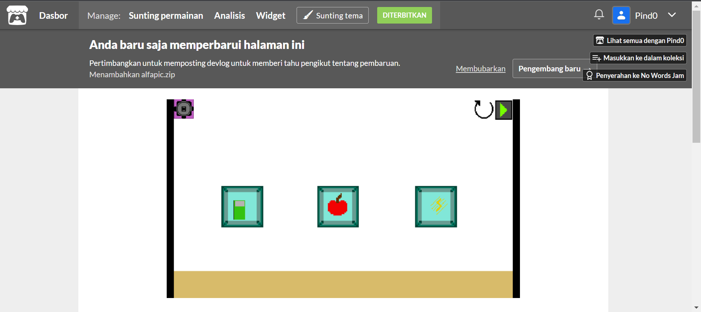

# Penjelasan Singkat
game ini dibuat dengan skript bahasa pemrograman gdscript yang mengandung bahasa python dan javascript

## Klik ini

## Screenshot

# Foto Diagram
## use case Model

## activity Model
### 1. mulai

### 2. muat data

### 3. simpan data

### 4. database

## sequence Model
### 1. mulai

### 2. muat data

### 3. simpan data

## class diagram

## deployment diagram

## data model

